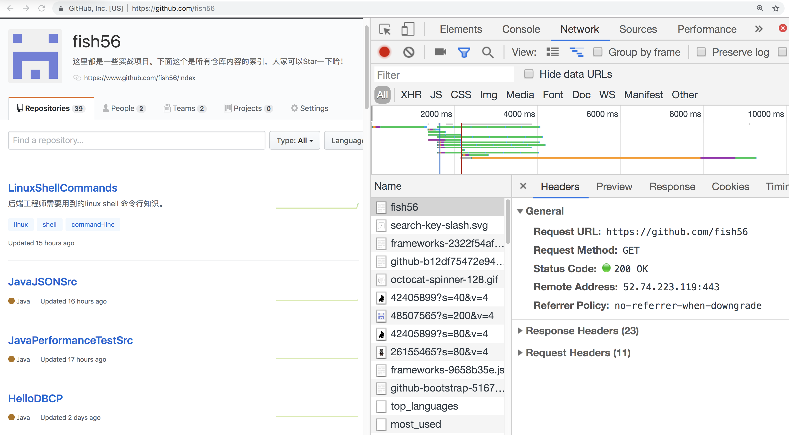
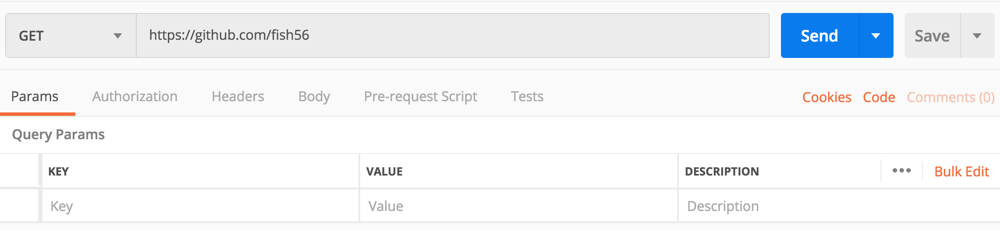
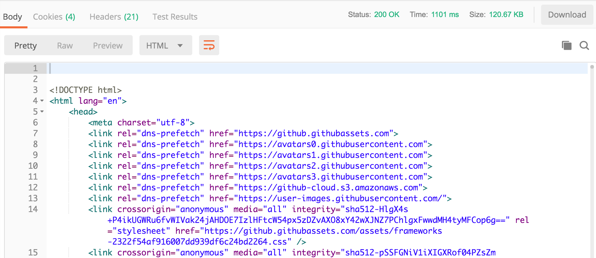
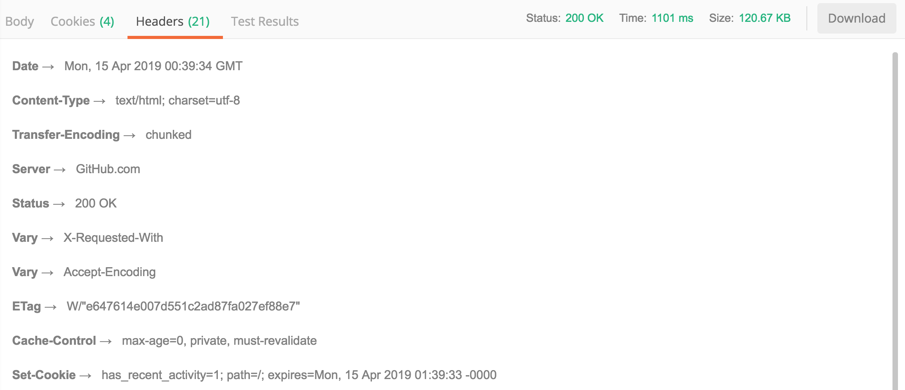

在我之前学习HTTP协议的时候，最大的问题是对HTTP协议没有一个感性的认识，被什么请求方法啊、状态码啊这些概念搞得晕晕乎乎的。所以在接下来内容中，我会首先和大家一起从多个角度探讨下HTTP协议。

- 通过浏览器、postman发起HTTP请求
- 编写一个node的HTTP服务器
- 通过wireshark转包来解开HTTP的什么面纱

#### HTTP协议的基本模型

HTTP协议是基于请求-响应模型的。

- 每个HTTP请求都包含以下信息

  - 请求的方法(上面的都是GET方法)

  - 请求的路径
  - 请求头部
  - 请求体

- 每个响应都包含以下信息

  - 响应的状态码
  - 响应头部
  - 响应体

理解了上面的内容，基本就不会对HTTP协议迷惑了。

上面是我访问github页面时，浏览器向github发起的HTTP请求，我们可以看到浏览器发起了多个HTTP请求。

不过浏览器的调试界面对于初学者来说是不太友好的，接下来我们通过postman来访问github首页。

然后我们看一下postman的页面，上面的内容非常清楚，postman让我们设置http请求报文的基本信息。

- 左上角的是请求方法，我们可以选择我们将要发起的HTTP请求的请求方法是什么
- 然后中间的输入框让我们输入请求的URL。

- 下面则是一个列表，可以让我们输入请求的Params，Header，以及Body。

现在点击反送，数秒中我们就可以看到响应的内容了

响应的内容包括

- 状态码。在右上角显示状态码是200
- 响应体，显示在Body栏里面
- 响应头部，在第二章截图显示的位置里面。

然后我们可以看到，这其中只有一个HTTP请求与响应。那是因为HTTP协议本生就是一个请求对应一个响应的模式。我们在浏览器的控制台看到那么多HTTP报文是因为浏览器会解析收到HTML响应，然后根据HTML的内容，再次发起了多个HTTP请求。

