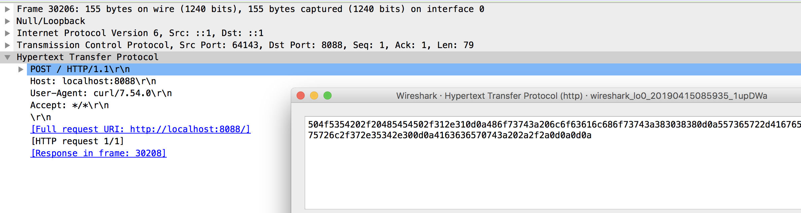

接下来我们用node编写一个简单的服务器。

- 因为nodejs非常适合写一个小的web服务器
- 不会node也没关系，代码很简单，就是http请求很响应

下面就是非常简单的服务端代码：

```js
// 引用HTTP模块
const http = require('http')

// 创建一个HTTP服务器实例
let server = http.createServer((req, res) => {
  res.end("hello world")
})

// 监听8088端口
server.listen(8088)
```

- node中有个内置的http模块，可以非常快速搭建web服务器
- http.createServe()r用来创建一个服务器的实例。
- node会将请求报文的相关信息包装到req这个参数中
- 当我们调用res.end()后，node会将res中的相关信息打包成HTTP响应报文，发送给客户端
- 然后server.listen()后，服务器启动，node会监听8088端口的相关内容。

总之，上述代码就是让node监听8080端口，然后收到HTTP请求之后返回一个hello world的字符串。

启动服务器后，我们使用curl来访问服务器。(这里如果使用postman的话，它会和服务器保持长连接，产生很多无关紧要的报文，看起来可能有点费事。不过也没有大碍，我是使用curl，方便读者阅读)

```bash
$ curl http://localhost:8088
hello world%
```

这里是抓包的结果：


可以看到，因为是本地回环测试，所以数据包很稳定，没有触发TCP的自动纠错机制，所以上面的数据非常明确清晰。

上面一个共是12个报文

- 三次握手
- 同时服务端发送了[TCP Window Update]，这个报文不用理会，和HTTP无关
- 客户端向服务器发送了一个GET请求
- 服务端收到GET请求之后，立刻返回[ACK]报文告知客户端：我收到你的请求了
- 服务端解析GET请求，做出一些业务逻辑，返回给客户端一个HTTP响应报文
- 客户端收到HTTP响应后，立刻向服务端发起[ACK]报文告知服务端：我收到你的响应了
- 四次分手


然后HTTP报文说白了，就是我上面截图所显示的，一行行的内容。你可以鼠标选中上述的位置，然后右键，选择


然后就可以看到HTTP报文的二级制格式了


因为请求头部是使用utf8编码的，所以我们可以通过把它转化为utf8字符串


蛤，大家有没有看到，HTTP报文就是**简单的不能再简单的、普通的不能再普通的字符串**了！！！

`GET`这个字符串按照UTF8编码的话，它的二级制表示是`474554`,而`POST`是`504f5354`。所以可以看到我们的上面的二级制报文的开始的几位是`474554`。它甚至都没有使用一些魔法数字，比如使用二进制的`0000 0001`代表GET请求，使用`0000 0002`代表 POST请求，统统没有。

接下来是请求的路径，默认我们访问的`/`路径。然后有读者可能会想了，域名呢？为什么请求路径上不包含域名相关的信息呢？HTTP协议中是对目标的域名、IP、端口号透明的。一开始通过DNS解析包域名转化为IP地址，目标IP是写在IP报文头部的。而我们没有指定目标的端口号，HTTP协议默认的端口是80，HTTPS默认的端口号是443，目标端口是写在TCP报文头部里面的。。所以只看HTTP报文的话，我们是不知道这个报文要发送到哪里的。

然后path一般的格式是这样的:`/fish56?utf8=✓&q=http`。前面用`/`分割的是路由，中间用`?`隔开，后面的是查询字符串，一般写成`key1=value1&key2=value2`的格式。几乎所有的web服务框架都是基于路由来划分请求的，每个HTTP请求根据它的path来匹配一个路由函数。

接下来就是一行一行的请求头部了。写成`header1: value1\r\n`的格式。每一个请求行都是以`/r` `/n`结尾的。后面我们分析HTTP协议，主要就是围绕着报文头部后分析的。


然后我们看看HTTP响应的格式和HTTP请求的格式基本相同，都有报文头部和报文体。就是报文第一行的格式不同。


响应报文第一行是 HTTP版本号 + 状态码 + 状态码对应的短语。

HTTP协议的版本目前就是只有HTTP/1.1，老的报文早被淘汰了，新的HTTP/2.0则不知猴年马月才能登场，大家写程序的时候其实也没有没要考虑它。

然后协议规定状态码应该是3位的数字，形如1xx, 2xx, 3xx, 4xx ...

然后后面状态码对应的原因短语其实现在看来是没有必要存在的，因为HTTP协议本身已经规定了每个状态码对应的原因了。HTTP协议规范明确说明这个原因短语应该被客户端忽略，哪怕它一直存在，大家写程序的时候可以不用管它。


#### 实践

假如我使用curl向服务器发送一个POST请求，你能够自己计算出TCP传输中，对应的HTTP报文的二级制编码吗？

```bash
$ curl -X POST http://localhost:8088 
```

很简单，对应的HTTP报文就是下面的内容

```
POST / HTTP/1.1 
Host: localhost:8088 
User-Agent: curl/7.54.0 
Accept: */* 
 
```

把它转化为二级制就行了，我们用一些在线工具转化下。

应该是长这样的：

```
504f5354202f20485454502f312e310d0a486f73743a206c6f63616c686f73743a383038380d0a557365722d4167656e743a206375726c2f372e35342e300d0a4163636570743a202a2f2a0d0a0d0a
```

和第一个除了请求方法不同，其他的是一致的


那么我们上面的对不对呢？用curl发起请求后通过抓包来验证一下！




然后就是这样，一模一样，HTTP报文没有任何神秘的地方，就是普通的字符串，只不过我们约定按照特定的格式来解读。想手写报文非常简单。

上面的内容可能对有些同学来说像是废话，但是我自己以前学习的时候，确实遇到了这样的困惑，所以我想把这些说明白。


所以事情就很简单了，HTTP报文本质上就是：

- 普通的字符串，在网络传输时内转化为了二级制字节流

- 它是基于TCP协议的
  - 在发起HTTP请求之前，要先建立TCP连接
  - 每个HTTP报文可能被分解为多个TCP报文(在上面的例子中没有体现，我们后续会演示的)
- 

好了，现在假设让我们自己基于TCP协议实现一个HTTP协议，你知不知道怎么写？

HTTP报文就会白话的字符串，然后把它通过utf8解码后的二进制流通过TCP报文发送出去就完事了。

比如我想向服务器发起这样的请求：

```
PATCH /fish56 HTTP/1.1
Connection: keep-alive
header1: value1
header2: value2

Hello world!!!!!!!!!!!!! 
```

然后自要把它转化为二级制流：

```
5041544348202f66697368353620485454502f312e310a436f6e6e656374696f6e3a206b6565702d616c6976650a2e2e2e2e0a686561646572313a2076616c7565310a686561646572323a2076616c7565320a0a48656c6c6f20776f726c642121212121212121212121212120
```

通过TCP协议发送就完事了。


#### 何为协议？

我们知道，现在web主要是BS模式，即浏览器 - 服务器 。 浏览器厂商在设计浏览器的时候并不知道用户将来会浏览什么网页，服务器程序在设计时并不知道用户将来会用那个浏览器访问。

为了让浏览器和服务器能正常的沟通，人们提出了HTTP协议。协议吗，只是建议性的，不是强制性的。比如你自己写了一个客户端和服务端，那么你用GET方法上传文件，使用404状态码表示正常响应也没有问题。

当我们谈论HTTP协议的时候，很大程度上是说浏览器对HTTP协议的实践。比如说GET请求，HTTP协议并没有强制规定GET请求不能上传数据，但是以我的经验，如果你在Chrome浏览器发起ajax请求的话，浏览器会禁止你携带请求体。

同理，不同的状态码之间的区别也是语义化的区别。以我的经验，如果本该是200正常的响应，你非要设置成404或者505，其实对用户使用是没有任何影响的。除了3xx,浏览器遇到这样的状态码会直接触发重定向，其他的状态码是可以混用而不影响正常使用的，但是遵守HTTP协议是一个合理的工业实践。


#### 请求头部和响应头部有什么区别？

它们格式一模一样，不过在HTTP协议中，有些头部是专门用于请求报文，有些事专门用于响应报文。


#### HTTP报文是怎么编码？

前面的请求头都是UTF8编码的。而报文体则不确定，只是二进制流，没有明确的格式，需要通过`ContentType`这个报文头部来指定。我们上面能够看到`hello world`，只是因为它恰好也是utf8编码的。


