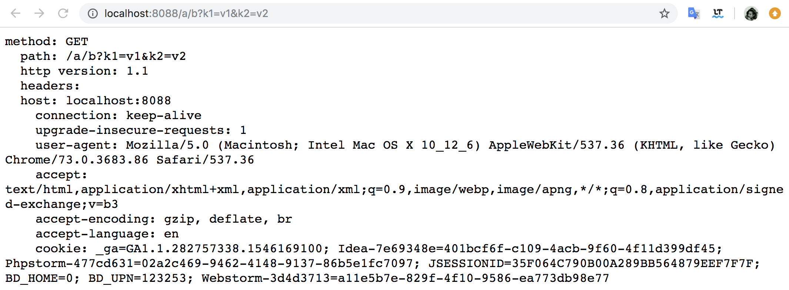
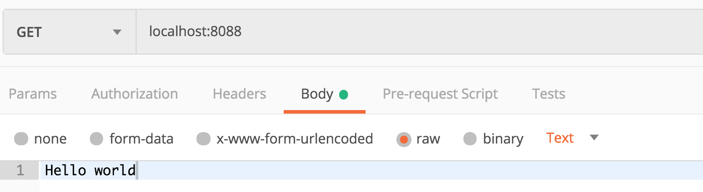
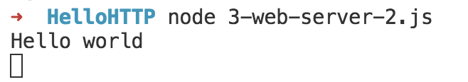
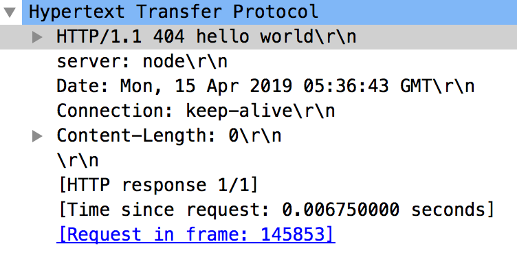

## Web 服务器

接下来我们来编写一个简单的web服务器。

现在后端有各大编程语言鼎足而立，每个编程语言又有上百种web服务框架，眼花缭乱！！

但其实万变不离其中，每个web服务器框架，无论是SpringMVC，还是Koa、Express，或者 Flask、Django。它也许有很多丰富的特性，但是万变不离其宗，它们都遵循下面的基本模型。

- 接受到HTTP请求，解析出其中的请求方法、路径、Headers、Body
- 做出相应的业务逻辑
- 设置HTTP响应报文的状态码、Headers以及Body，并返回


#### 获取请求报文

下面就一node为例，编写一个简单的服务器，它将读取请求报文的基本信息并返回。我在学习任何一个框架的时候都会首先写出类似下面的程序。

```js
const http = require('http')

let server = http.createServer((req, res) => {
  let method = req.method;
  let path = req.url
  let version = req.httpVersion
  let headers = req.headers;

  res.write(`method: ${method} 
  `)
  res.write(`path: ${path} 
  `)
  res.write(`http version: ${version}
  `)
  res.write(`headers: 
  `)
  for (const header in headers) {
    res.write(`${header}: ${headers[header]}
    `)
  }
  res.end()
})

server.listen(8088)
```

- req.method: 读取请求方法
- req.url 读取请求的路径
- req.headers读取请求的头部
- res.write() 向响应体中写入数据

总体来说，上面的程序就是在接受HTTP请求之后，把HTTP请求报文中携带的信息有返回给了客户端。



就是这样，非常简单。

至于请求体，因为请求体的长度提前不好判断，它可能是由非常多个TCP报文传输的。所以，基本上每个编程语言的原生模块都是通过流来读取的，node中是获得Stream，Java Servlet是InputStream来读取。

我们来看下下面的代码：

```js
const http = require('http')

let server = http.createServer((req, res) => {

  req.on('data', chunk => {
    console.log(chunk.toString('utf8'))
  })
  req.on('end', () => {
    res.end('ok')
  })
})

server.listen(8088)
```

在node中，req的原型链上就有Steam.prototype，这是node中同来处理流的方式。我们可以通过req.on('data'）这个事件不断的读取请求体中的内容。然后读取到的chunk是一个Buffer对象，我们把这个buffer对象转化为utf8的字符串，并且打印出来。



然后我们通过postman发起一个携带请求体的报文。

然后就可以看到服务器收到请求后，解析出了请求体的数据。



其他都是一样的，万变不离其宗。


#### 设置响应报文

接下啦，我们来设置一下响应体的信息。

如果我们希望返回一个状态码为404，响应头部添加一个`server: node`字段，我们如何写程序呢？

可以这样

```js
const http = require('http')

let server = http.createServer((req, res) => {
  res.statusCode = 404
  res.statusMessage = 'hello world'
  res.setHeader('server', 'node')
  res.end()
})

server.listen(8088)
```



通过抓包，可以验证我们成功的设置了状态码以及响应头部。

