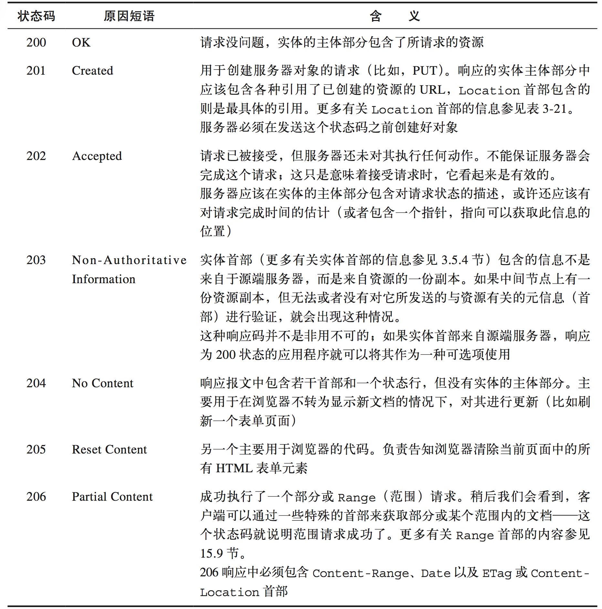
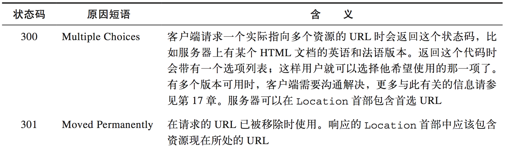
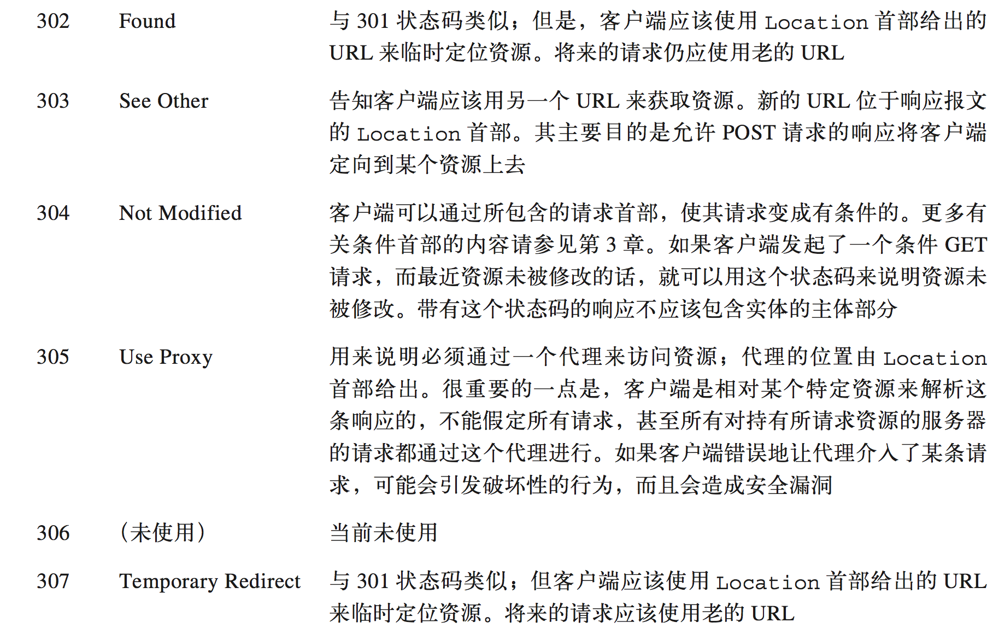
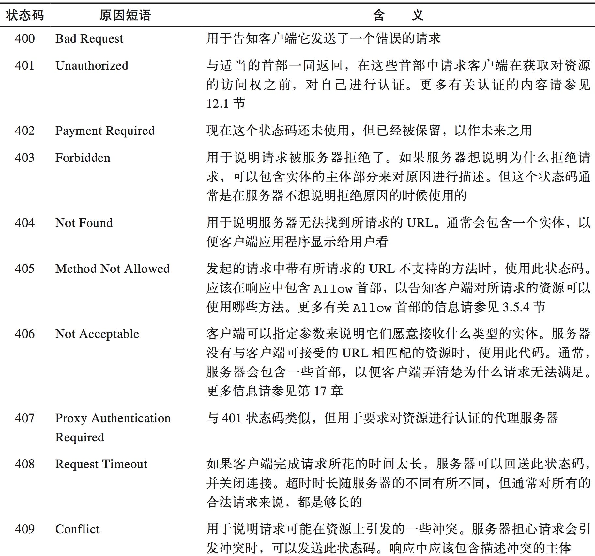
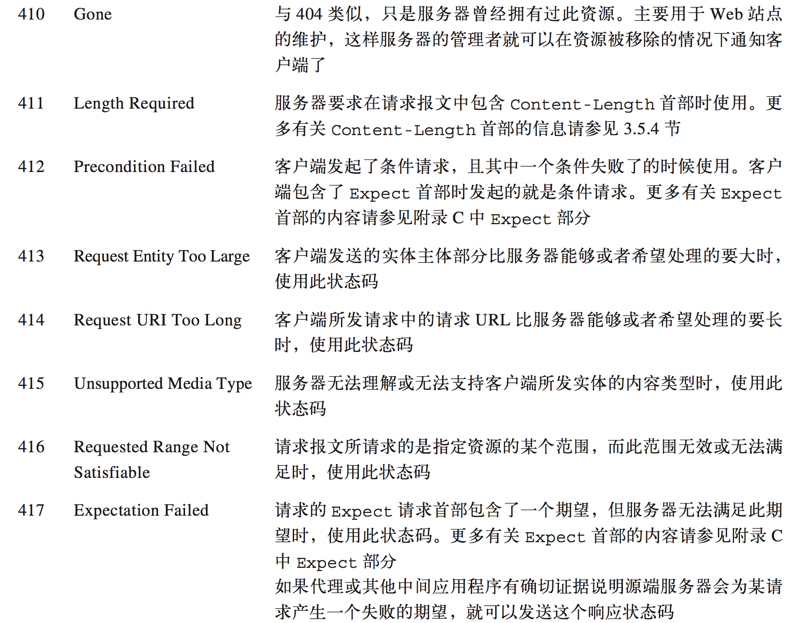
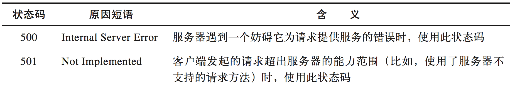
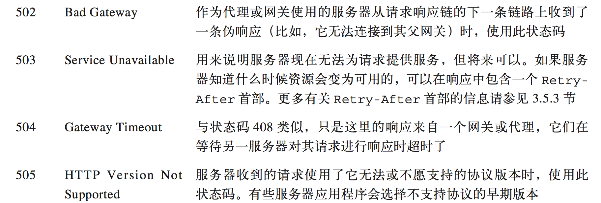

简单的概述完HTTP报文之后，我们就看些每个地段究竟代表那些信息。这个东西没什么好说的，大家心里有个大概就行了，没必要死记硬背。

### 请求方法

#### GET

表明希望从服务器获取资源

#### HEAD

表明希望服务器只返回报文的头部，不返回报文体。这样客户端就可以读取响应头部，来判读资源的而一些信息，决定下一步如何处理。

#### PUT

表明客户端希望向服务器写入文档

#### POST

表明客户端希望向服务器发送数据

#### OPTIONS

询问服务器支持哪些方法

## 状态码

### 100~199——信息性状态码

### 200~299——成功状态码

上图引用自HTTP权威指南(下面也是的)

### 300~399——重定向状态码

### 400~499——客户端错误状态码

### 500~599——服务器错误状态码

## 报文头部

然后HTTP协议中，服务器和客户端主要就是通过报文头部的字段来进行沟通的。每个字段写成`name: value`的形式，name不区分大小写。后面慢慢的说。