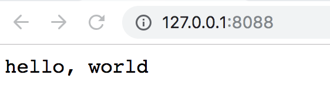
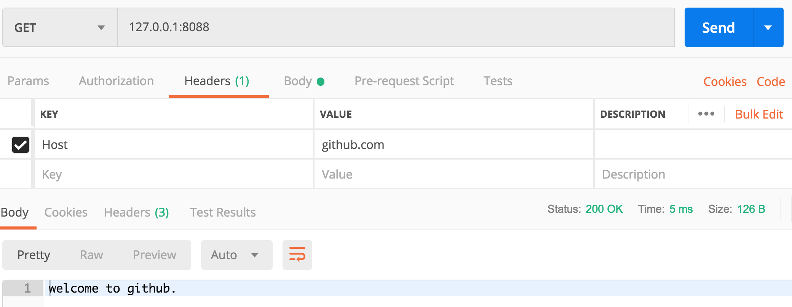

### 重定向- Location字段

我们知道，301，302这两个状态码是作为重定向使用的，它们通常要配合`Location: github.com`这样的字段使用。

```js
const http = require('http')

let server = http.createServer((req, res) => {
  res.statusCode = 302
  res.setHeader('Location', 'https://github.com/fish56')
  res.end()
})

server.listen(8088)
```

使用上面的代码启动服务器，然后当你访问localhost:8088的时候，你就会自动跳转到github的网页上去。


### 反向代理 - Host字段

我们知道，一台服务器可以部署多个网站，比如让www.aaa.com 和 www.bbb.com都指向123.1.1.1这个ip的80端口，这是怎么实现的呢？

其实，浏览器发起一个HTTP请求的时候，会携带一个类似于`Host: www.aaa.com`这样的字段，表明用户是希望访问这个网址，那么我门的服务器就可以判断这个字段的值，然后做出的响应的逻辑判断。


```js
const http = require('http')

let server = http.createServer((req, res) => {
  let host = req.headers['host']
  if(host == 'localhost:8088'){
    res.write('hello, welcome to localhost:8088')
  } else if(host == 'github.com') {
    res.write('welcome to github.')
  } else {
    res.write('hello, world')
  }
  res.end()
})

server.listen(8088)
```

首选我们通过`127.0.0.1:8088`访问服务器




我们可以看到，当我们直接通过ip地址访问服务器的时候，浏览器携带的Hose字段是`Host: 127.0.0.1:8088`。

而通过localhost这个域名访问时，浏览器携带的字段是`Host: localhost:8088  `。我们的服务器就是可以通过这个字段来做出不同的响应。



上面就是Nginx之类服务器的反向代理的原理。


#### User-Agent

浏览器发起HTTP请求时，都会携带一个User-Agent的字段，告知服务器浏览器的种类、版本以及一些操作系统相关的形象。

```
User-Agent: Mozilla/5.0 (Macintosh; Intel Mac OS X 10_12_6) AppleWebKit/537.36 (KHTML, like Gecko) Chrome/73.0.3683.86 Safari/537.36
```

服务器拿到这个字段后，可以判断出用户是移动端还是桌面端、是IE还是Chrome，进而决定发返回合适的数据。


我们知道，当我们访问一个站点的时候，往往要发起多个HTTP请求，在早期，客户端每次发起HTTP请求都要建立单独的TCP连接，接受到响应后再关闭TCP连接，下次需要发起请求的时候再继续创建，而TCP的三次握手是非常耗时的。

所以在HTTP协议中的，我们只要在响应头部添加`Connection: Keep-Alive`就是告知客户端不要关闭当前的TCP链接，在HTTP/1.1中，这个响应都不是默认添加的。