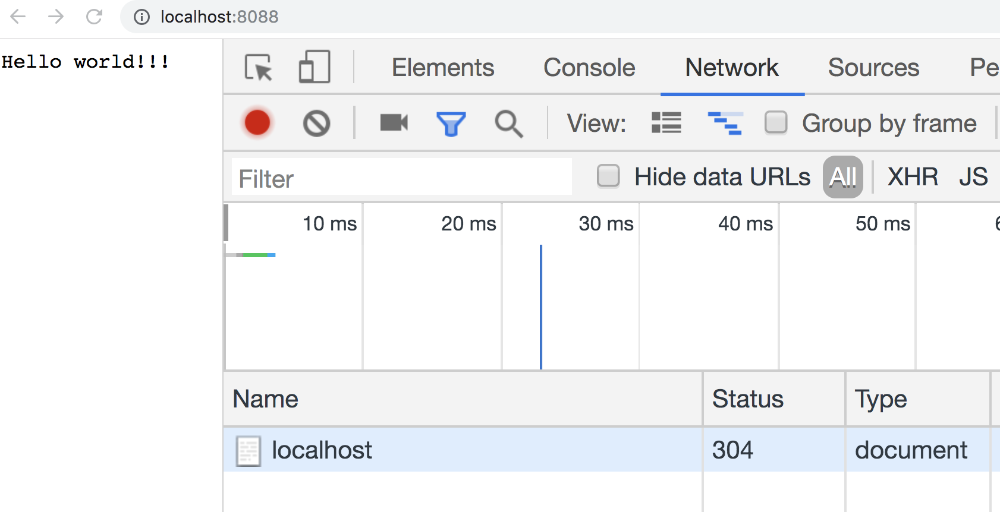

## 缓存

为了提高用户体验以及减少服务器的压力，缓存是HTTP协议中极为重要的概念。它主要由下面的字段来管理的。

学习缓存主要有两点

- 如何设置缓存
- 缓存的过期、校验机制

缓存毕竟不是原始的资源，校验缓存是否过期是最麻烦的但是必不可少的一环。

#### Cache-Control

Cache-Control是HTTP/1.0规定的，我们可以通过在响应头部添加这个字段来告知浏览器应该把这个响应报文缓存`max-age`秒：

```js
const http = require('http')

let server = http.createServer((req, res) => {
  res.setHeader('Cache-Control', 'maxage=3000')
  res.write('Hello world!!!')
  res.end()
})

server.listen(8088)
```

然后大家可以在浏览器中测试一下，第一次请求完毕后后去的请求是否会从本地缓存中获取。

Chrome是不会缓存的，它会自作主张的把maxage设置为0。所以尽量不要用这个字段，下面两个字段是更好的选择。

#### ETage

如果我们给响应报文添加ETag字段，就是相当于给这个资源打上一个唯一标识符。以后浏览器再次发起请求的时候，就会在请求头中告知服务器缓存资源的ETag，由服务器来判断用户浏览器返回的资源有没有过期。

如果服务器发现用户浏览器的资源过期了，那就直接返回新的资源；如果服务器发现资源没有过期，那就返回一个状态码为304的响应。

```js
const http = require('http')

let server = http.createServer((req, res) => {
  if(req.headers['if-none-match'] == 'qqwwee'){
    res.statusCode = 304
    res.end()
  } else{
    res.setHeader('ETag', 'qqwwee')
    res.write('Hello world!!!')
    res.end()
  }
})

server.listen(8088)
```

上述的代码中，用户第一次访问服务器后，服务器没有检查到`if-none-match`这个字段，就会返回新的资源。

第二次访问服务器的时候，服务器发现用户资源没有过期，就会返回304报文。



#### Last-Modified

这和上面的一模一样

```js
const http = require('http')

let server = http.createServer((req, res) => {
  if(req.headers['if-modified-since'] != null) {
    res.statusCode = 304
    res.end()
  } else {
    res.setHeader('last-modified', new Date().toISOString())
    res.write('hello world')
    res.end()
  }
})
```

上面的代码中，我们给响应头设置了last-modified。然后浏览器缓存响应的报文后，再次访问资源就会携带if-modified-sice这个报文头部。 当然，正常情况下服务器应该判断资源是否过期，我这里为了方便，直接全部返回304了。

### 总结

下面是网上找的图，完美的总结了缓存模型

