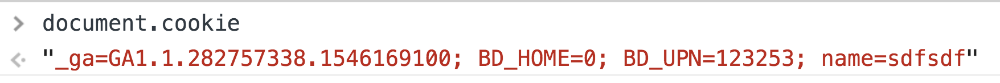
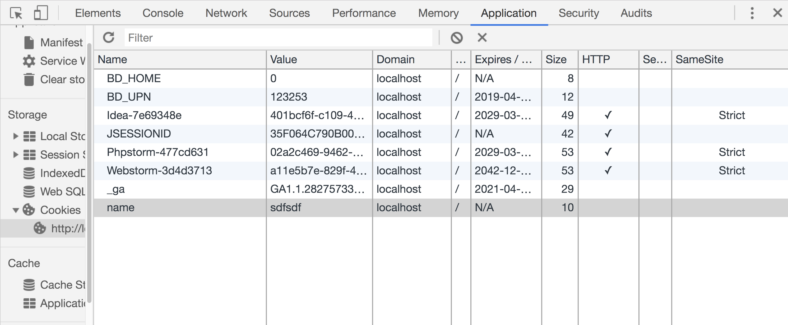
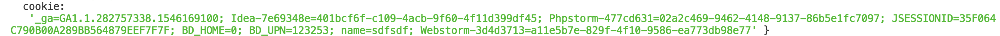
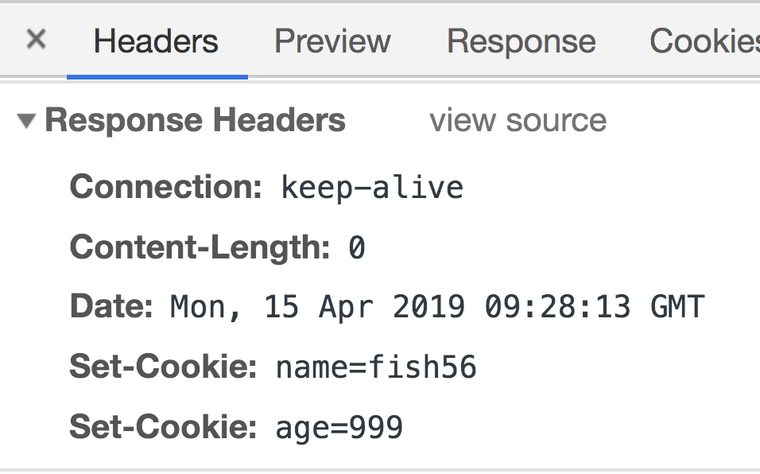
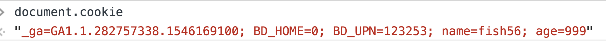

很多人有个误解，那就是cookie是用来做身份认证的。其实cookie本身和身份认证并没有关系，它就算是用来保存一段文本数据的，特殊之处在于浏览器会在发起HTTP请求的时候会把这段文本写入请求头的`Cookie`这个字段，就是这样简单。

#### 查看当前域名的cookie

1. 使用JS脚本：document.cookie

   

2. 使用Chrome的调试工具

   

3. 在服务器端提取HTTP请求中的cookie字段

   


#### 设置cookie

服务端主要是通过Set-Cookie这个字段来向Cookie中写入数据

```js
const http = require('http')

let server = http.createServer((req, res) => {
    res.setHeader('Set-Cookie', ['name=fish56', 'age=999'])
    res.end()
})

server.listen(8088)
```

看下结果





可以看到，我们确实成功的设置了Cookie


### Cookie的属性

每个cookie都可以设置属性来决定它们的特性

|     键     |                              值                              |
| :--------: | :----------------------------------------------------------: |
|   domain   |                   用来确定cookie适用的域名                   |
|    allh    | 是域中所有的主机都获取 cookie，还是只有指定了名字的主机获取。 |
|    path    |                域中与 cookie 相关的路径前缀。                |
|   secure   |                时候只有在ssl连接的时候才发送                 |
| expiration |        cookie的过期时间，默认的是在重启浏览器后失效。        |

#### cookie的作用域

上面我们设置了cookie，但是接下来就有问题了name字段是localhost:8088这个域名设置，那么

- 用户访问localhost:8099的时候，浏览器会不会携带这个地段？

- 用户访问a.localhost的时候，浏览器会不会携带这个字段？
- 用户访问github.com的时候，浏览器会不会携带这个地段？

答案取决你设置：

- 访问localhost:8099一定可以，因为域名是一样的。

  根据[RFC 6265](http://tools.ietf.org/html/rfc6265)

  > 8.5. Weak Confidentiality
  >
  > **Cookies do not provide isolation by port**. If a cookie is readable by a service running on one port, the cookie is also readable by a service running on another port of the same server. If a cookie is writable by a service on one port, the cookie is also writable by a service running on another port of the same server. For this reason, servers SHOULD NOT both run mutually distrusting services on different ports of the same host and use cookies to store security sensitive information.

  cookie在同一域名下的不同端口是共享

- 访问github.com一定不会携带，因为这会产生安全问题

- 访问a.localhost则取决于你的设置，通过domain字段指定


#### 过期时间

默认在重启浏览器后cookie就会被清楚

#### secure

如果你服务器是HTTPS加密的，可以考虑把这个值设置为true