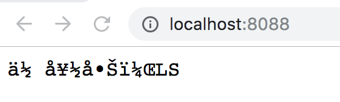
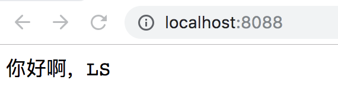
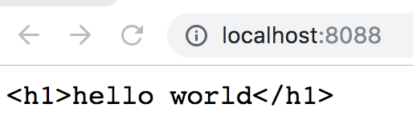
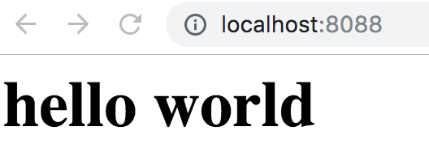

## 编码

编码这个问题，一次搞清楚，终生舒服。

我们的文件分为两种

- 文本文件

  文本文件可能是utf8编码、acsii编码。编码之后按照内容的格式，可能分为

  - HTML文件
  - JSON文件
  - 普通的文本文件
  - 。。。。。。。。

- 二进制文件

  然后每个二级制值文件前面会有一个8个字节的内容，表标识自己。

  比如PNG图片前面的几个字节就是。。。。。

  这个列表非常多，大家知道就行了


我之前说过，HTTP报文头部就是用UTF8编码的，而报文主体只是二进制流，我们必须通过`Content-Type`这个字段告知浏览器如何解析这个二进制字节流。

那你可能或问了，之前我们并没有设置ContentType，为什么浏览器正常解析除了其中的字符串？

因为浏览器默认使用ascii解码，而我们发送的`hello world`是urf8编码，对于英文字母来说，它们的ASCII和utf8编码是一样。

现在我们修改下程序

```js
const http = require('http')

let server = http.createServer((req, res) => {
  res.write('你好啊，LS')
  res.end()
})

server.listen(8088)
```

这时候再访问页面，我们可以看到出现乱码了



解决方案就是在ContentType中设置`text/plain; charset=utf-8`

```js
const http = require('http')

let server = http.createServer((req, res) => {
  res.setHeader('Content-Type', 'text/plain; charset=utf-8')
  res.write('你好啊，LS')
  res.end()
})

server.listen(8088)
```



| 类型     | ContentType      |
| :------- | ---------------- |
| 普通文本 | text/plain       |
| HTML格式 | text/html        |
| JSON格式 | application/json |

同理，对于HTML文件，我们也要设置ContentType：

设置前：



设置后：

```json
const http = require('http')

let server = http.createServer((req, res) => {
  res.setHeader('Content-Type', 'text/html; charset=utf-8')
  res.write('<h1>hello world</h1>')
  res.end()
})

server.listen(8088)
```



### Mime-Type

