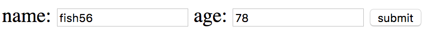
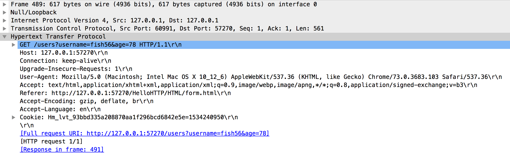
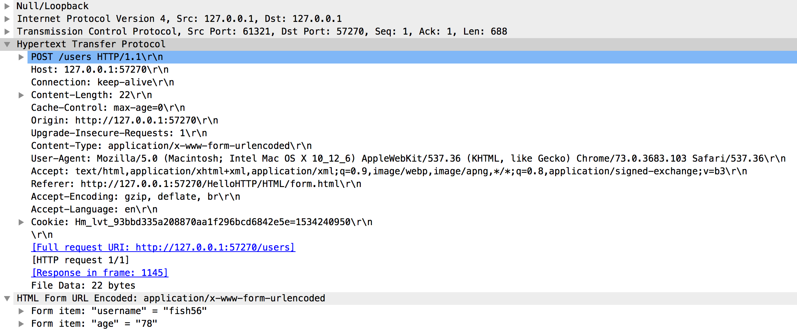
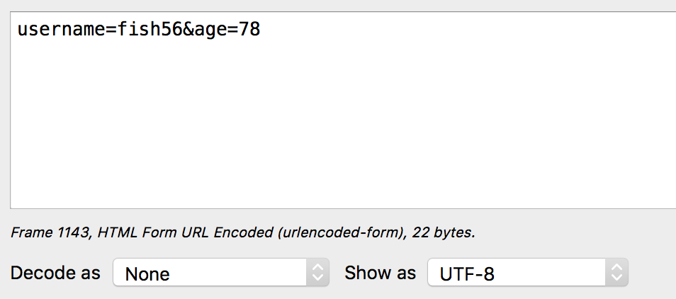

## Form 表单

我以前学习form表单的时候被各种概念搞得莫名其妙，其实，如果仔细观察下HTTP报文的话，你会发现这个很 简单。

假设这个是前端HTML代码

``` html
  <form action="/users" method="get">
    name: <input type="text" name="username">
    age: <input type="text" name="age">
    <input type="submit" value="submit">
  </form>
```



然后各位可以猜一下点击提交后，它的HTTP请求报文长什么样子。

👇是我抓包的结果：



可以看到，就是把form表单里面的数据被写成了查询字符串而已。

然后我们我们把form表单里面的method修改为post，然后再来抓包：





蛤，可以看到通过post方法还是有点不一样的

- 查询字符串被写到了请求体里面
- 多了一个` Content-Type: application/x-www-form-urlencoded`请求头
  
  ## 参考资料
https://dev.to/sidthesloth92/understanding-html-form-encoding-url-encoded-and-multipart-forms-3lpa
