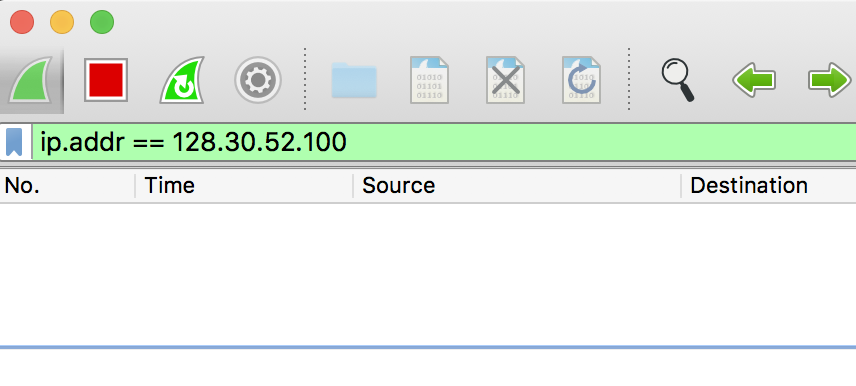
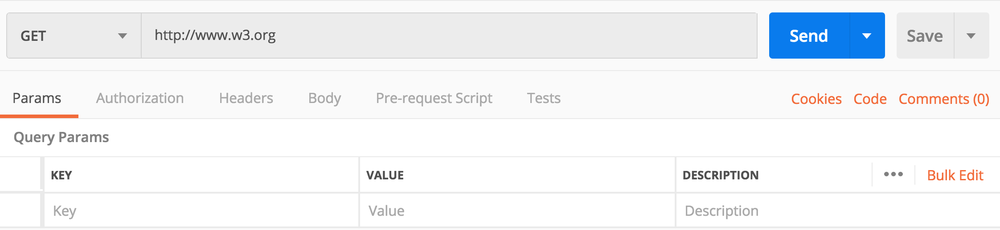
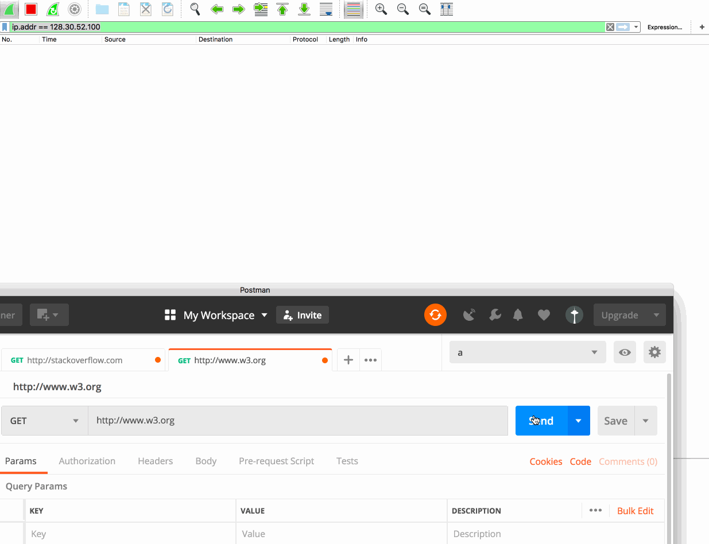
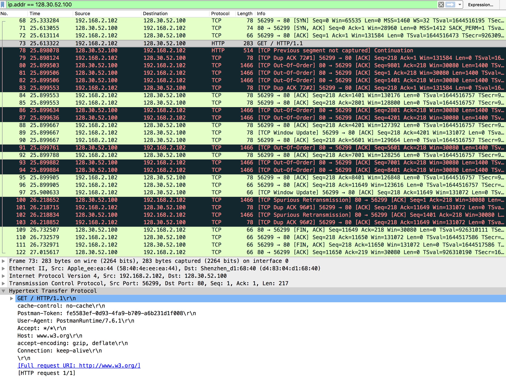
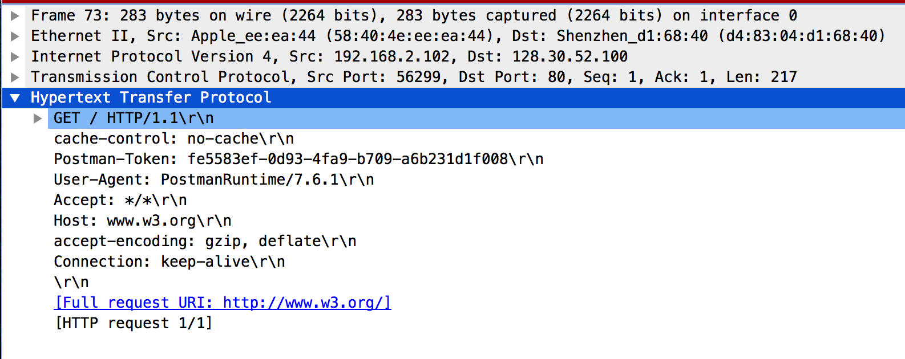
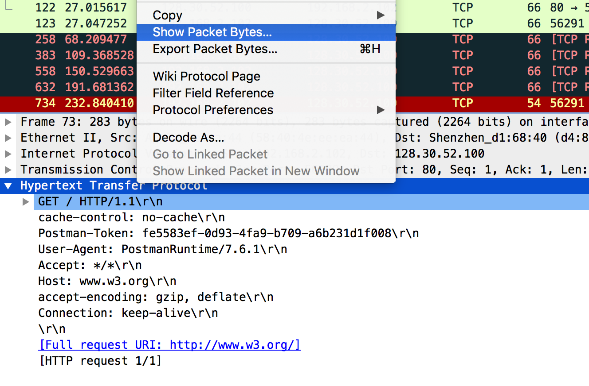
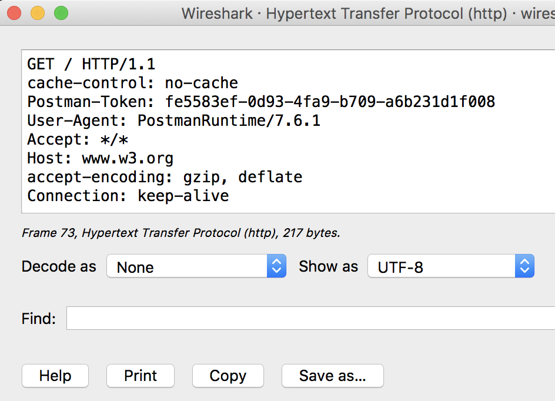

首先HTTP、TCP的基本概念网络上已经写的非常多了，我就不重复了，这里我主要是通过抓包来帮助大家理解下HTTP协议。

阅读之前，你其需要有：

- 一点点的HTTP、TCP的知识

  什么三次握手啦之类的，网上已经写的很多了
- 会使用wireshark 以及postman

  这两款是学习TCP HTTP的神器，一定要会用的
- DNS解析这块我就略过了


那么，就以 http//www.w3.org 为例吧，我们看看当我们向www.w3.org发起一个GET请求时，中间究竟有哪些TCP报文的传输。

首先我们通过`nslookup`来获得www.w3.org 对应的ip地址：

```bash
$ nslookup www.w3.org
Server:		8.8.8.8
Address:	8.8.8.8#53

Non-authoritative answer:
Name:	www.w3.org
Address: 128.30.52.100
```

拿到ip地址后，我们就可以在wireshark中通过`ip.addr == 128.30.52.100`过滤出我这台电脑和www.w3.org 服务器之间发送过的TCP报文了。



如上图所示，目前我们还没有和服务器相连接。

接下来我们就可以通过postman来连接www.w3.org 来看看中间的报文传输了。

记得注意一下几点

- 不要以github.com为抓取对象，因为github.com对应多个IP地址，会给我们的抓包带来不便

- 不要以https://www.w3.org 为抓包对象，因为它是通过https加密的，不方便我们观察
- 如果你的浏览器目前打开了www.w3.org，记得关闭它，因为那样会使得浏览器和服务器持续连接，给我们的抓包带来干扰
- 不是用浏览器发起连接是因为：浏览器会解析收到的html文件，然后解析出其他静态资源，并再次发起多个HTTP请求，不方便我们的观察


然后我们准备通过postman发起请求，并注意观察wireshark抓包的情况。



好了，准备完毕，点击发送，开始抓包！！！！！！




上面就是一次HTTP请求与响应之间存在的TCP报文的传输。




- 前三个数据包是三次握手产生的
- 三次握手之后，我们的postman向w3.org的服务器发起了一个GET请求，就是上图的鼠标选中的那个
- 然后呢， 因为是网络传输，所以中间不可避免的产生很多异常，所有中间有很多看起来莫名其妙的TCP报文，它们是TCP协议自动纠错的机制产生的，不用管
- w3.org给的响应报文比较大，被分割成了多个TCP报文
- 最后面四个数据包是四次分手产生的

上面就是一次网络传输的基本情况。等会我们会编写自己的服务器，那样看起来就很舒服了。


#### HTTP报文由哪些部分组成？

HTTP报文分为请求报文和响应报文。

##### 请求报文

- 请求行
  - 请求方法
  - 请求路径
  - HTTP版本号
- 请求头
- 请求体

##### 响应报文

- 响应起始行

- - HTTP版本号

  - 状态码

  - 原因短语

- 响应头部

- 响应体


然后上面说的太抽象了，我们具体的看一下。



说白了，就是上面的内容，我们鼠标选中上述的位置，右键



然后选中`Show Packet Bytes`，就可以看到我们这个请求的对应的二进制流


同时，我们的HTTP报文使用UTF8编码的，我们把它转化为utf8编码的字符串



怎么样，其实HTTP报文就是普普通通的字符串，是TCP报文的一部分。


其实说这么多废话的原因是因为我以前学习HTTP协议的时候，没有一个感性的认识，学的一头雾水。HTTP协议就是把上面的字符串做出特殊解释。


HTTP协议把报文按照行来分割。

第一行包含了请求方法，请求的路径，HTTP的协议版本。

首先是请求方法。问：GET POST方法有什么区别？

- 从HTTP报文上来说，它们没有什么区别，仅仅只：`GET`这个字符串按照UTF8编码的话，它的二级制表示是`474554`,而`POST`是`504f5354`,仅此而已。
- 从HTTP协议的角度来说，GET应该用于请求资源，POST应该用来创建资源。但是协议嘛，没有强制性，你要是用GET请求来创建资源，也没人拦着你
- 从浏览器的角度来说：浏览器可能会有一写特殊的行为，比如在使用AJAX技术的时候，GET请求不能携带请求头。但是注意，只是浏览器的个人行为，HTTP协议并没说GET请求一定不能携带请求体。

注意分辨浏览器自定义的特性和HTTP协议规定的内容两者之间的区别，有助于我们的学习。


请求方法和请求路径之间间隔了一个空格，空格对应的utf8二进制表示是`20`，你在上面的二进制字节中应该可以轻易的找到。


接下来就是一行一行的请求头了。这个以后是重点解释的内容了。


所以看到HTTP协议没有什么神秘的地方，就是**普通的不能再普通的字符串了**！！！！

只不过我们按照约定的习惯来解释它们，同它们来传递信息了。


